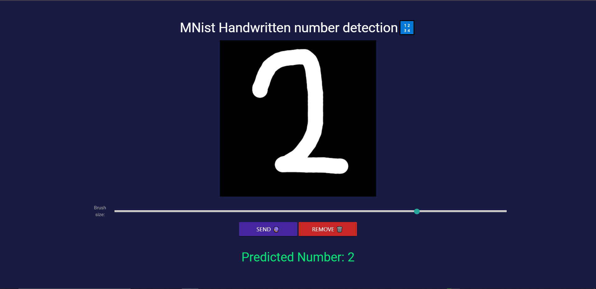

# Handwritten Digit Recognition with Django

This project is a **handwritten digit recognition system** built with **Django**. The system allows users to draw a digit on a web interface, and it predicts the number using a trained machine learning model.

## 🚀 Features
- **Draw digits on the canvas** 🎨
- **Real-time prediction** using a trained model 🤖
- **REST API endpoint** for digit recognition
- **Modular design** to improve or replace the model easily

## 📷 Screenshots


## 🛠 Installation & Setup
### 1️⃣ Clone the repository:
```bash
git clone https://github.com/your-username/your-repo.git
cd your-repo
```
### 2️⃣ Install dependencies:
```bash
pip install -r requirements.txt
```
### 3️⃣ Apply migrations:
```bash
python manage.py migrate
```
### 4️⃣ Run the api server:
```bash
cd django_api_server/apiserver
python manage.py runserver localhost:8000
```
### 5️⃣ Run the site:
```bash
cd site/mnsite
python manage.py runserver localhost:8080
```
Now, open `http://localhost:8000` in your browser. 🎉

⚙️ Changing the API server port

If you don't want to run the API server on port 8000, you need to update the frontend configuration:

- Open: site/mnsite/detect/templates/index.html

- Go to line 117:
```
url: "http://localhost:8000/api/predict/",
```

- Change 8000 to your desired port.

## 🔍 How It Works
1. The user draws a digit on the web interface.
2. The drawing is converted to a format suitable for the model.
3. The trained model predicts the digit.
4. The result is displayed.

## 🔗 Machine Learning Model
The trained model used for digit recognition can be found in **[this repository](https://github.com/Ehsan-004/MnistNumberDetection)**. Clone it and create ```model.pkl``` and ```scaler.pkl``` files to use them. You can experiment with improving the accuracy or trying different architectures.

## 💡 How to Use Your Own Model
If you want to use a different model, replace the existing one in the project and update the prediction logic in `views.py`. Note that the model and scaler are in ```.pkl``` extension.

